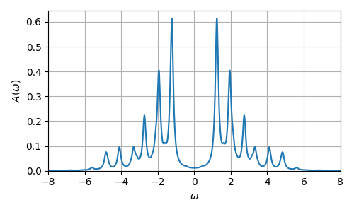

# Exact diagonalization

[![Tests][tests-badge]][tests-url]
[![License: MIT][license-badge]][license-url]
[![Code style: black][black-badge]][black-url]


|⚠️|  This project is still under heavy development and might contain bugs or have breaking API changes in the future. |
|----|:------------------------------------------------------------------------------------------------------------------|


## 🔧 Installation

Install via `pip` from github:
```commandline
pip install git+https://github.com/dylanljones/exactdiag.git@VERSION
```

or download/clone the package, navigate to the root directory and install via
````commandline
pip install .
````

## 🚀 Quick-Start


### Basis

A ``Basis`` object can be initalized with the number of sites in the (many-body) system:

````python
import exactdiag as ed

basis = ed.Basis(num_sites=3)
````

The corresponding states of a particle sector can be obtained by calling:
````python
sector = basis.get_sector(n_up=1, n_dn=1)
````
If no filling for a spin-sector is passed all possible fillings are included.
The labels of all states in a sector can be created by the ``state_labels`` method:
````python
>>> sector.state_labels()
['..⇅', '.↓↑', '↓.↑', '.↑↓', '.⇅.', '↓↑.', '↑.↓', '↑↓.', '⇅..']
````
The states of a sector can be iterated by the ``states``-property.
Each state consists of an up- and down-``SpinState``:
````python
state = list(sector.states)[0]
up_state = state.up
dn_state = state.dn
````
Each ``SpinState`` provides methods for optaining information about the state, for example:
`````python
>>> up_state.binstr(width=3)
001
>>> up_state.n
1
>>> up_state.occupations()
[1]
>>> up_state.occ(0)
1
>>> up_state.occ(1)
0
>>> up_state.occ(2)
0
`````


### Operators

The ``operators``-module provides the base-class ``LinearOperator`` based on ``scipy.LinearOperator``.
A simple sparse implementation of a Hamiltonian is also included.
````python
import exactdiag as ed

size = 5
rows = [0, 1, 2, 3, 4, 0, 1, 2, 3, 1, 2, 3, 4]
cols = [0, 1, 2, 3, 4, 1, 2, 3, 4, 0, 1, 2, 3]
data = [0, 0, 0, 0, 0, 1, 1, 1, 1, 1, 1, 1, 1]
indices = (rows, cols)
hamop = ed.HamiltonOperator(size, data, indices)
````
Converting the operator to an array yields
````python
>>> hamop.array()
[[0 1 0 0 0]
 [1 0 1 0 0]
 [0 1 0 1 0]
 [0 0 1 0 1]
 [0 0 0 1 0]]
````

Many-Body Hamiltonian matrices can be constructed by projecting the
elements onto a basis sector. First, the basis has to be initialized:
````python
import exactdiag as ed

basis = ed.Basis(num_sites=2)
sector = basis.get_sector()  # Full basis
````

The Hubbard Hamilton-operator, for example, can then be constructed as follows:
````python

def hubbard_hamiltonian_data(sector):
    up_states = sector.up_states
    dn_states = sector.dn_states
    # Hubbard interaction
    yield from ed.project_hubbard_inter(up_states, dn_states, u=[2.0, 2.0])
    # Hopping between sites 0 and 1
    yield from ed.project_hopping(up_states, dn_states, site1=0, site2=1, hop=1.0)

rows, cols, data = list(), list(), list()
for i, j, val in hubbard_hamiltonian_data(sector):
    rows.append(i)
    cols.append(j)
    data.append(val)

hamop = ed.HamiltonOperator(sector.size, data, (rows, cols))
````

### Models

Some methods require a model object to work. Users can define their own
models or use one of the following included models:

| Module     | Description                                         | Lattice support    |
|:-----------|:----------------------------------------------------|:-------------------|
| abc        | Model-Parameter container and abstract base classes | -                  |
| anderson   | Anderson impurity models                            | :x:                |
| hubbard    | Hubbard model                                       | :heavy_check_mark: |              |


A custom model can be defined by inheriting from the abstract base classes.
Many-body models, for example, have to implement the `_hamiltonian_data` method,
which generates the rows, columns and values of the Hamilton operator for each
basis sector:

````python
import exactdiag as ed


class CustomModel(ed.models.AbstractManyBodyModel):

    def __init__(self, num_sites, eps=0.0, ...):
        super().__init__(num_sites, eps=eps, ...)

    def _hamiltonian_data(self, up_states, dn_states):
        yield from ed.project_onsite_energy(up_states, dn_states, self.eps)
        ...
````

The Hamilton operator can then be acessed for the full basis or a specific sector
in operator or matrix representation:
````python
model = ed.models.HubbardModel(num_sites=2, neighbors=[[0, 1]], inter=2)

# Sector n↑=1, n↓=1
hamop = model.hamilton_operator(n_up=1, n_dn=1)

# Full basis
sector = model.basis.get_sector()
ham = model.hamiltonian(sector=sector)
ed.matshow(ham, ticklabels=sector.state_labels(), values=True)
````
<p align="center">
  
</p>

### Green's function

Using a custom defined model or one of the included models the one-particle
(many-body) Green's function can be computed, for example using the Lehmann sum:
````python
import numpy as np
import exactdiag as ed

model = ed.models.HubbardModel.chain(num_sites=7, inter=4.0, beta=10.0).hf()

z = np.linspace(-8, +8, 1001) + 1e-1j
gf = ed.gf_lehmann(model, z, i=3, sigma=ed.UP)[0]
````
<p align="center">
  
</p>


[tests-badge]: https://img.shields.io/github/workflow/status/dylanljones/exactdiag/Test/master?label=test&logo=github&style=flat
[license-badge]: https://img.shields.io/github/license/dylanljones/exactdiag?color=lightgrey&style=flat-square
[black-badge]: https://img.shields.io/badge/code%20style-black-000000.svg?style=flat-square

[license-url]: https://github.com/dylanljones/exactdiag/blob/master/LICENSE
[black-url]: https://github.com/psf/black
[tests-url]: https://github.com/dylanljones/exactdiag/actions/workflows/test.yml
